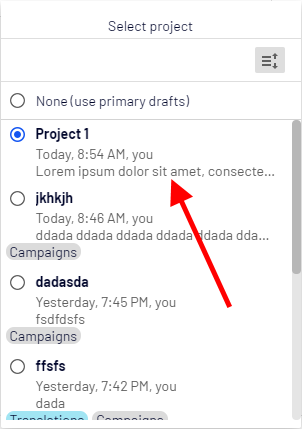

# Episerver Labs - Project Enhancements

The project contains a few features that, in general, make the life of Episerver editors easier.

The list of current features is as following:
* [Page tree indicator](#page-tree-indicator)
* [Selected project tooltip](#selected-project-tooltip)
* [Project description](#project-description)
* [Project categories](#project-categories)
* [Project visible to](#project-visible-to)
* [Notification tooltip](#notification-tooltip)

## Install

Episerver Labs Project Enhancements is available as a [Nuget](https://nuget.episerver.com/package/?id=EPiServer.Labs.ProjectEnhancements) package for CMS add-ons.
To use it in a project, install the `EPiServer.Labs.ProjectEnhancements` package:

```console
Install-Package EPiServer.Labs.ProjectEnhancements
```

## Development in this repository

```console
>> build\tools\nuget.exe restore
>> setup.cmd
>> build.cmd
>> test.cmd
>> site.cmd
```

## Page tree indicator

With this feature Editor will see which items belongs to current project.
All pages that are part of current project will be indicated using  icon.


## Selected project tooltip

Episerver saves last selected project. When Editor logs in to the edit mode, 
the last selected project will be automatically set. Sometimes it can be confusing.
That why, after Editor logs in, we will display tooltip with current project information.


## Project description

Using this feature Editor will be able to add short description about the 
purpose of the project.

The description can be set in project edit dialog:


And then it's diaplyed on project overview:


and in the project selector list:



## Project categories

Project categoies feature is similar to project description. 
It allows Editor to categorize projects. 


Categories are displayed in project selector:


To configure categories you need to implement `IProjectCategoriesDataSource` interface
and register it in ConfigurableModule: 

````
[InitializableModule]
[ModuleDependency(typeof(EPiServer.Web.InitializationModule))]
public class ProjectCategoryInitialization : IConfigurableModule
{
    public void Initialize(InitializationEngine context)
    {
    }

    public void Uninitialize(InitializationEngine context)
    {
    }

    public void ConfigureContainer(ServiceConfigurationContext context)
    {
        context.Services.AddTransient<IProjectCategoriesDataSource, DefaultProjectCategoriesDataSource>();
    }
}

public class DefaultProjectCategoriesDataSource: IProjectCategoriesDataSource
{
    public IEnumerable<ProjectCategoryItem> List()
    {
        return new[]
        {
            new ProjectCategoryItem
            {
                Id = "Campaigns",
                Name = "Campaigns",
                Color = ProjectCategoryColor.Gray,
                Description = "Used to publish Alloy campaigns"
            },
            new ProjectCategoryItem
            {
                Id = "Translations",
                Name = "Translations",
                Color = ProjectCategoryColor.Teal,
                Description = "Used by translation companies"
            },
            new ProjectCategoryItem
            {
                Id = "Site",
                Name = "Site branding",
                Color = ProjectCategoryColor.Yellow,
                Description = "Used when editing content"
            }
        };
    }
}
````

## Project visible to

This feature allows to limit list of items displayed in project selector based on user roles:


## Notification tooltip

This feature is used to display tooltip on notification bar. Tooltip contains
information about when project was last edited and by who.


## Options

All features can be turn on and off using ProjectOptions class:

````
[InitializableModule]
public class ProjectOptionsInitialization : IConfigurableModule
{
    public void ConfigureContainer(ServiceConfigurationContext context)
    {
        context.ConfigurationComplete += (o, e) =>
        {
            context.Services.Configure<ProjectOptions>(options =>
            {
                options.ShowPageTreeIndicator = false;
                options.ShowDescription = false;
                options.ShowCategories = false;
                options.ShowNotificationTooltip = false;
                options.ShowSelectedProjectTooltip = false;
            });
        };
    }

    public void Initialize(InitializationEngine context)
    {
    }

    public void Uninitialize(InitializationEngine context)
    {
    }

    public void Preload(string[] parameters)
    {
    }
}
````

By default all options are enabled.

## Telemetry information

In a quest to understand our users more and effectivize our resources so that we can deliver the best user experience possible, we've decided to gather some useful telemetry so that we can make more informed decisions on what we should improve, support
and maybe not pursue when developing new features for CMS UI. We assure that the data we collect is completely anonymized and will only be used internally for making decisions on improving the user experience.

If you allow us to learn more about what we should be building, please make sure these two URL's are not blocked:

* Live Configuration: `https://cmsui.episerver.net/api/telemetryconfig`
* Tracking: `https://dc.services.visualstudio.com/v2/track` (this can change on Microsoft's discretion)

### Taxonomy of custom events

#### Always included

Every tracking event includes [standard Application Insights dimensions](https://docs.microsoft.com/en-us/azure/azure-monitor/app/api-custom-events-metrics#trackevent). The [authenticated user and client ID](https://docs.microsoft.com/en-us/azure/azure-monitor/app/api-custom-events-metrics#authenticated-users) are set as:

* `ai.user.authUserId`: String, a SHA512 hash without salt, using user email if available and username otherwise. To anonymize user but allow tracking between products.
* `ai.user.accountId`: String, a SHA512 hash without salt, using the License key. To allow for grouping of users.

Additionally we are tracking:

[TODO: ]

### Please note
> Episerver Labs projects are meant to provide the developer community with pre-release features with the purpose of showcasing ongoing work and getting feedback in early stages of development.
>
> You should be aware that Labs are trials and not supported Episerver releases. While we hope you use them, there are a few things you should expect from each release:
> - Functionality may be added, removed, or changed.
> - Labs projects have not been through the same quality assurance process as the versioned products and, in some cases, may show unexpected behavior.
>   - The Episerver CMS UI team notes that:
>     - the scenarios in the Readme of each CMS Lab's repo will be verified and supported us
>     - the Labs add-on may or may not work with other add-ons, we are not testing them
>     - any such issues found, such as scenarios outside of the the Readme, can be fixed by the community by submitting a Pull Request on the Github repo
> - The software may not work on all environments.
>   - The Episerver CMS UI team notes that:
>     - Although it should work on base installations of CMS UI in Chrome and Firefox
> - There is no Episerver support; however, we will gratefully receive all feedback
>   - The Episerver CMS UI team notes that:
>     - Issues created on GitHub will be triaged, and if accepted, fixed by us
>
> The software is provided “As is” without warranty of any kind or promise of support. In no event shall Episerver be liable for any claim, damages or liability in relation to the software. By using this software you are also agreeing to our developer program terms [https://www.episerver.com/legal/program-terms/](https://www.episerver.com/legal/program-terms/)